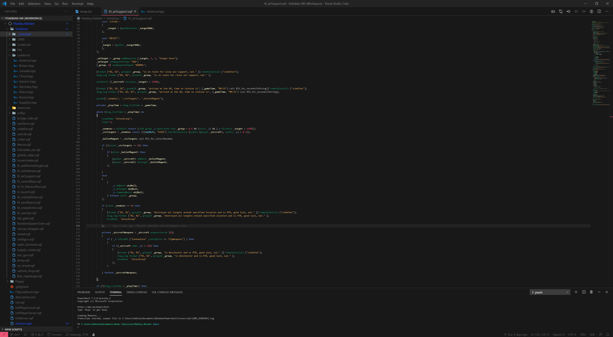

# Aebian's VS-Theme
## A lightweight but yet colorful theme to use. 

Theme is dark-mode only.

### Cloning

Pretty simple.  
1.) Go to \.vscode\extensions\  
2.) Then <kbd>git clone git@github.com:Aebian/vs-theme.git org.aebian.vs-theme</kbd>

